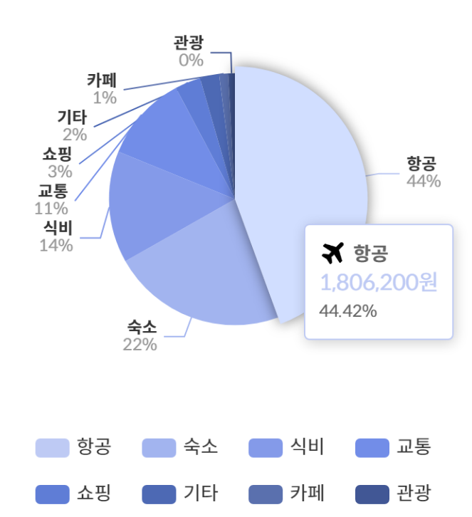

## Apache - Echarts

https://echarts.apache.org/en/index.html

- 파이 차트 만들어보기



```
<template>
  <div ref="pieChart" style="width: 100%; height: 400px;" class="my-chart"></div>
  <div class="explanation">
  </div>
</template>

<script>
import { onMounted, ref } from 'vue';
import * as echarts from 'echarts';
import { usePaymentStore } from '@/stores/paymentStore';
import { formatWithComma } from '@/stores/currencyStore';

// 이미지 파일을 import로 가져오기
import airplaneIcon from '@/assets/img/category/airplane.png';
import hotelIcon from '@/assets/img/category/hotel.png';
import vehicleIcon from '@/assets/img/category/vehicle.png';
import foodIcon from '@/assets/img/category/food.png';
import cafeIcon from '@/assets/img/category/cafe.png';
import shoppingIcon from '@/assets/img/category/shopping.png';
import tourIcon from '@/assets/img/category/tour.png';
import etcIcon from '@/assets/img/category/etc.png';

export default {
  setup() {
    const pieChart = ref(null);
    const paymentStore = usePaymentStore();

    // 카테고리별 아이콘 경로
    const icons = {
      '항공': airplaneIcon,
      '숙소': hotelIcon,
      '교통': vehicleIcon,
      '식비': foodIcon,
      '카페': cafeIcon,
      '쇼핑': shoppingIcon,
      '관광': tourIcon,
      '기타': etcIcon,
    };

    const calculateCategoryData = () => {
      const payments = paymentStore.getAllPayments;
      const categoryMap = {};

      payments.forEach((payment) => {
        const category = payment.category;
        if (!categoryMap[category]) {
          categoryMap[category] = 0;
        }
        categoryMap[category] += payment.cost;
      });

      // 카테고리별 총 금액을 내림차순으로 정렬
      const sortedCategoryData = Object.entries(categoryMap)
        .map(([name, value]) => ({ name, value }))
        .sort((a, b) => b.value - a.value);

      return sortedCategoryData;
    };

    onMounted(() => {
      const chart = echarts.init(pieChart.value);

      const categoryData = calculateCategoryData();

      const option = {
        // title: {
        //   text: '지출 내역',
        //   left: 'center',
        //   textStyle: {
        //     fontFamily: 'Spoqa Han Sans Neo',
        //     fontSize: 24,
        //   },
        // },
        tooltip: {
          trigger: 'item',
          formatter: function (params) {
            const iconUrl = icons[params.name]; // 해당 카테고리의 아이콘 URL 가져오기
            return `
              <div style="display: flex; align-items: center;">
                
                <strong style="font-size:14px;">${params.name}</strong>
              </div>
              <div style="font-size:16px; color:${params.color};">${formatWithComma(params.value)}원</div>
              <div style="font-size:12px;">${params.percent}%</div>
            `;
          },
          textStyle: {
            fontFamily: 'Spoqa Han Sans Neo', // 툴팁 글씨체 지정
          },
        },
        legend: {
          orient: 'horizontal',
          left: 'center',
          bottom: '3%', // legend의 위치를 아래로 조정
          itemGap: 20, // 항목 사이의 간격을 조정하여 4개씩 표시되도록 함
          width: '90%', // 4개씩 보기 좋게 배치되도록 넓이를 조정
          textStyle: {
            fontFamily: 'Spoqa Han Sans Neo', // legend 글씨체 지정
            fontSize: 14,
          },
        },
        color: [
          '#becaf4',
          '#98a8dd',
          '#6f83c8',
          '#5d73bd',
          '#eaebf0',
          '#c5c3c3',
          '#0b559f',
          '#356384',
        ],
        series: [
          {
            name: '지출',
            type: 'pie',
            radius: '55%',
            center: ['50%', '40%'], // 차트 위치를 조정하여 legend 공간 확보
            data: categoryData,
            emphasis: {
              itemStyle: {
                shadowBlur: 10,
                shadowOffsetX: 0,
                shadowColor: 'rgba(0, 0, 0, 0.5)',
              },
            },
            label: {
              formatter: function (params) {
                // params.percent의 정수 부분만 사용
                const percentage = Math.floor(params.percent);
                return `{nameStyle|${params.name}}\n{percentStyle|${percentage}%}`;
              },
              rich: {
                nameStyle: {
                  fontSize: 12,
                  fontFamily: 'Spoqa Han Sans Neo',
                  fontWeight: 'bold',
                  color: '#333',
                },
                percentStyle: {
                  fontSize: 12,
                  fontFamily: 'Spoqa Han Sans Neo',
                  color: '#999',
                },
              },
            },
          },
        ],
      };

      chart.setOption(option);
    });

    return { pieChart };
  },
};
</script>

<style scoped>
</style>

